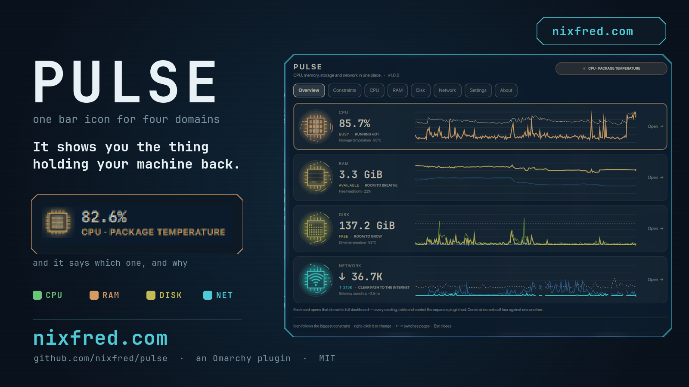
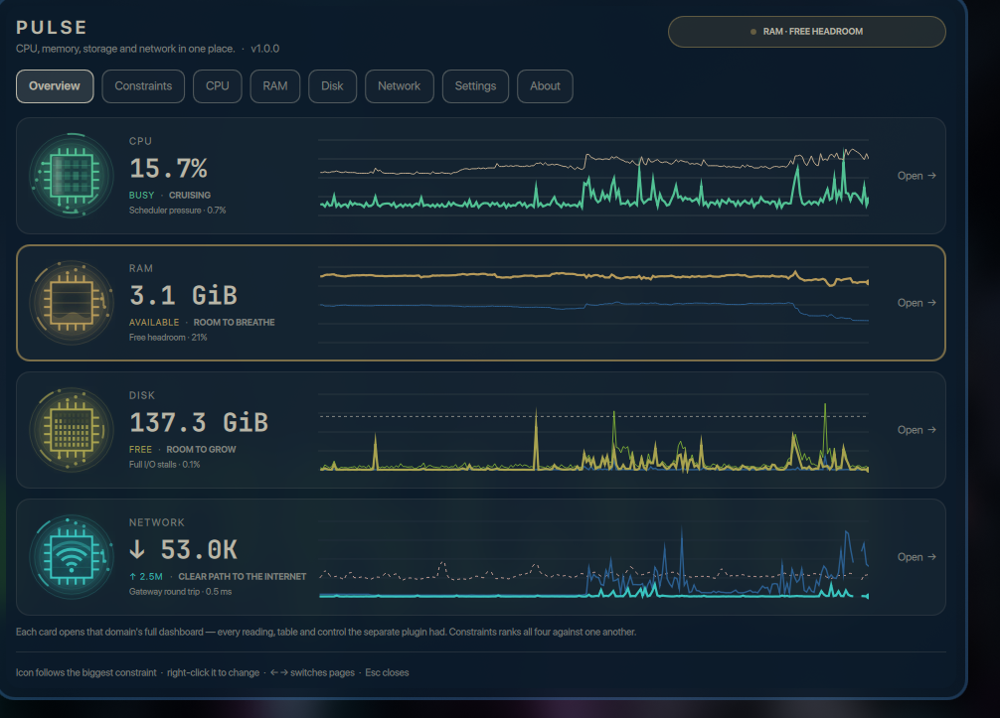
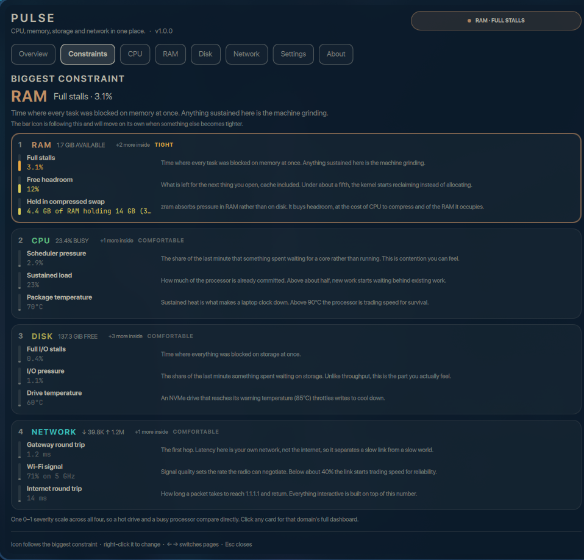
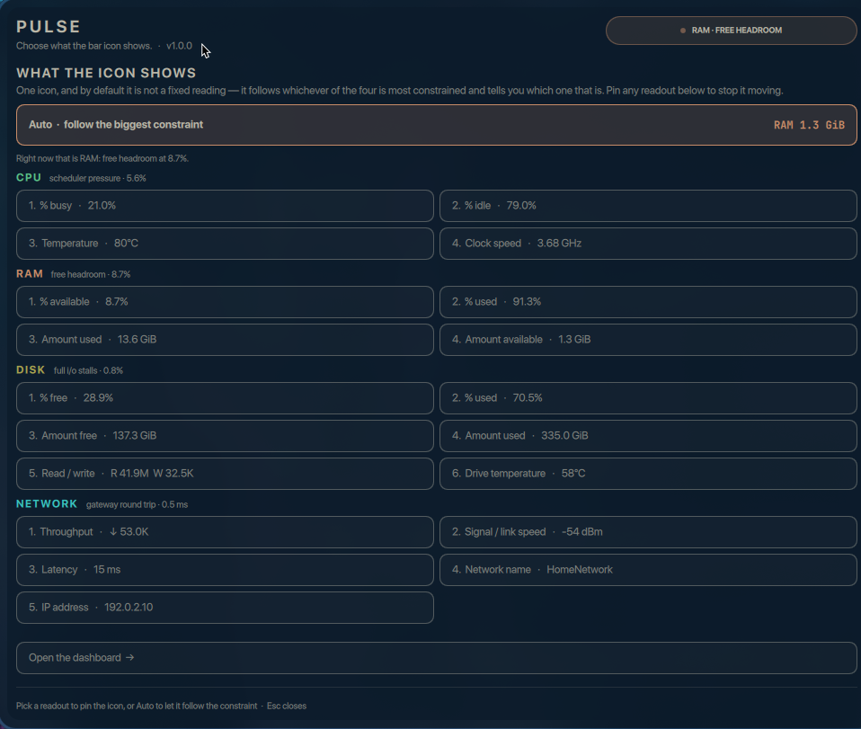
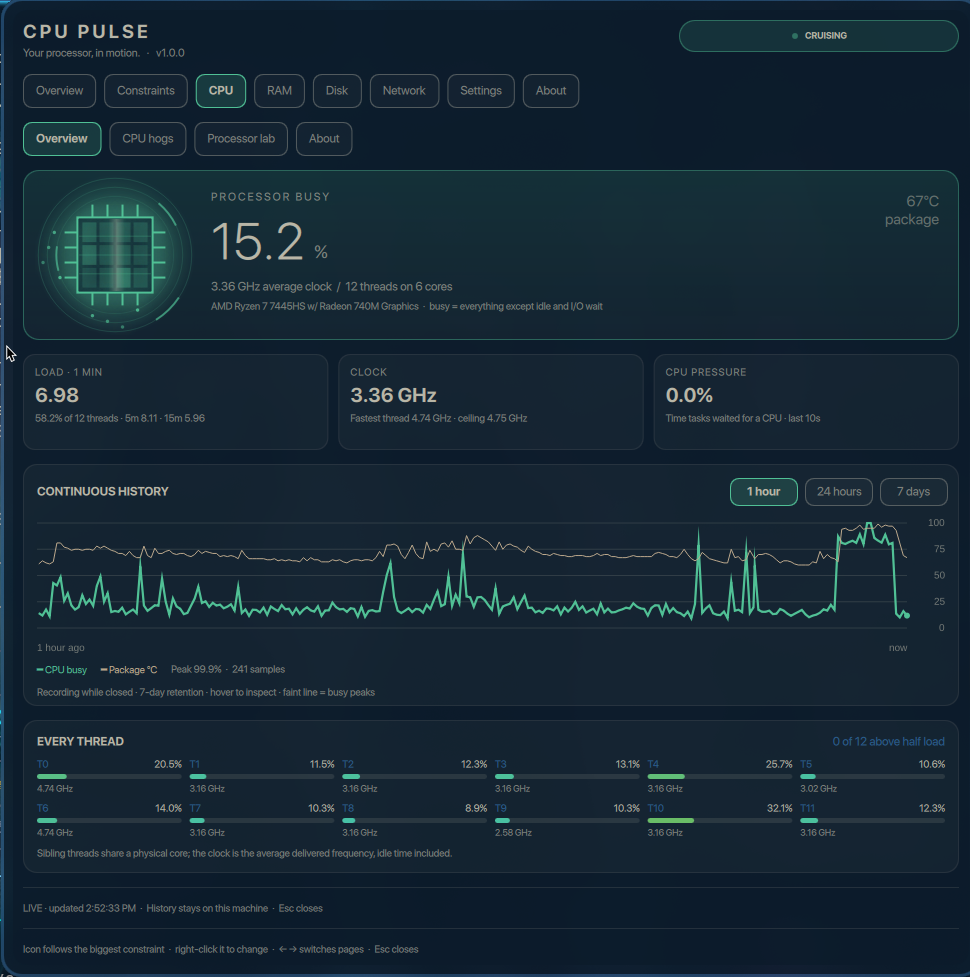
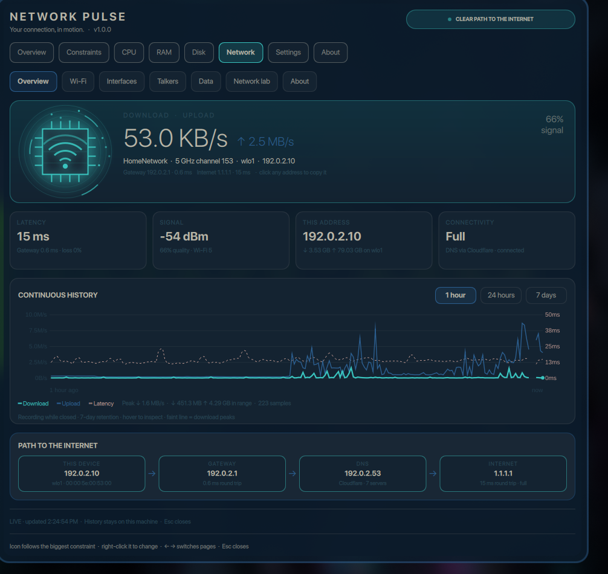
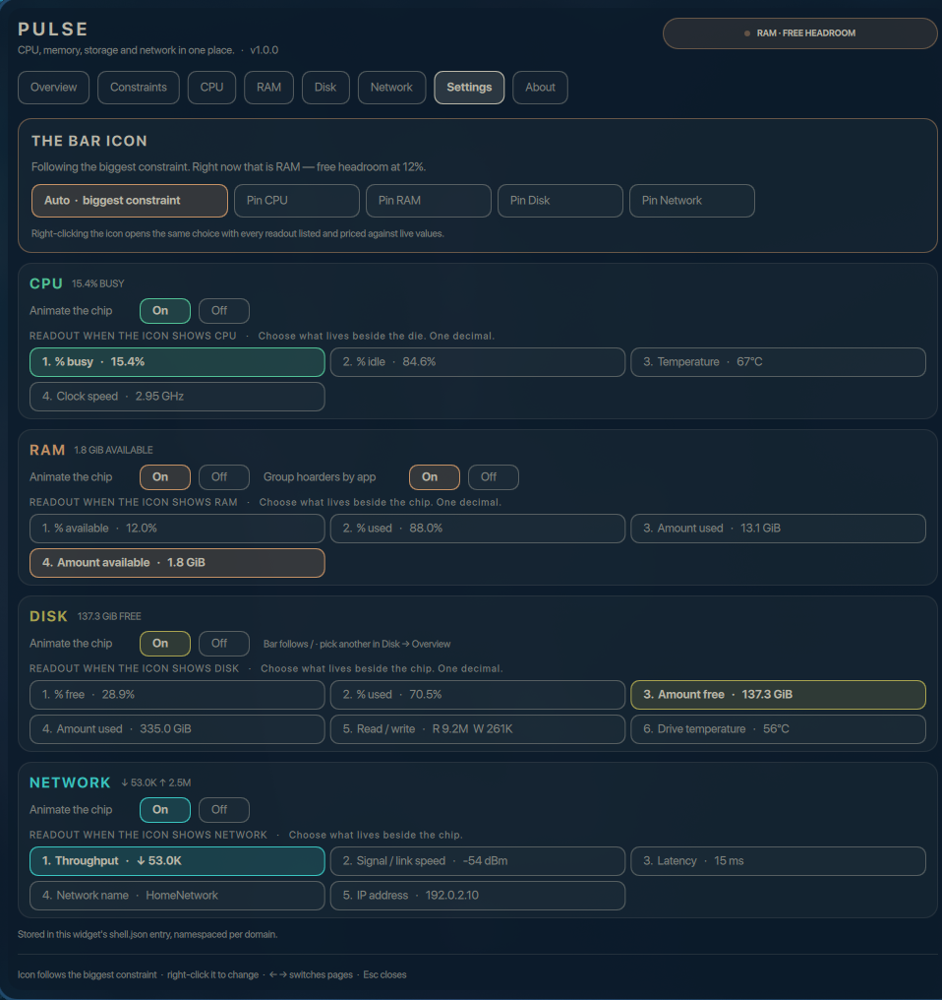

<div align="center">



# Pulse

**One Omarchy bar icon that always shows you the thing holding your machine back.**

CPU, memory, storage, network and GPU — five dashboards, one widget, zero guessing about which one is the problem.

## [nixfred.com](https://nixfred.com)

[](https://nixfred.com)
[](https://omarchy.nixfred.com)

[](https://omarchy.org)
[](https://quickshell.org)
[](CHANGELOG.md)
[](LICENSE)

</div>

---

## The idea

A system monitor that shows you five numbers is asking you to do the ranking.

Pulse shows every checked module on the bar, side by side — one chip per
domain, each in its own shape, colour and readout grammar. Uncheck a module and
its chip leaves the bar; the checked set is saved, so it survives restarts.

Every reading across all five domains is still scored on one shared severity
scale, and the worst domain keeps its marker — in the tooltip and the verdict
pill — so you always know which one is the problem and why:

```
▨  1.5 GiB          ▨  89°C              ▨  137.3 GiB
   RAM · LOW HEADROOM   CPU · PACKAGE TEMPERATURE   DISK · FREE SPACE ON /
```

<div align="center">

</div>

You choose what to watch by checking it. The ranking tells you which of the
checked modules needs attention.

And when you want the detail, all four original dashboards are still there,
whole, behind their own names.

<div align="center">

</div>

Each card is that domain's own chip, its own readout in its own grammar, its own
verdict, and its own history trace. Clicking one opens that domain in full.

---

## Constraints — the page that only exists because they are together

Separate monitors can each tell you how they are doing. None of them can
tell you which one is the problem, because none of them can see the other three.

<div align="center">

</div>

Domains are ranked worst first. Every reading gets a severity bar on one 0–1
scale, a real value, and a sentence explaining what it costs you — not a
threshold, an explanation:

| Domain | What it watches |
|---|---|
| **CPU** | sustained load, saturated threads, package temperature, scheduler pressure, power profile, throttling events |
| **RAM** | free headroom, pages swapped to disk, memory pressure, full stalls, compressed swap held in RAM |
| **Disk** | free space on the followed filesystem, drive busy time, I/O pressure, full I/O stalls, drive temperature, SMART warnings and wear |
| **Network** | route out, internet round trip, packet loss, Wi-Fi signal, gateway round trip |
| **GPU** | video memory in use, sustained load, temperature, and whether the driver is currently holding the card back |

The same scores drive the bar icon, so whatever the icon is showing is always
the top row of this page.

---

## Every readout, priced against live values

Right-click the bar entry. The top section is checkboxes — one per module, each
showing what it would read right now — so you decide against live values rather
than names. Below that, every readout of every domain, each showing what it
would read right now — so you pin against a real number rather than a name.

<div align="center">

</div>

Unchecking hides that module's chip. Pinning a readout shows a single chip that
stays put. Auto returns to the checked set.

---

## Nothing was summarised away

Each domain page is the original plugin's dashboard in full — the same
sub-tabs, tables, controls and numbers, reading the same recorder and the same
seven days of history.

<div align="center">


</div>

| Page | Tabs |
|---|---|
| **CPU** | Overview · CPU hogs · Processor lab · About |
| **RAM** | Overview · RAM hoarders · Memory lab · About |
| **Disk** | Overview · Disk hogs · Storage lab · About |
| **Network** | Overview · Wi-Fi · Interfaces · Talkers · Data · Network lab · About |
| **GPU** | Overview · GPU hogs · Graphics lab · About |

Connect to Wi-Fi, kill a memory hoarder, switch power profile, follow a
different filesystem — all of it still works, because it is the same code.

---

## Settings

Every setting the five domains have, grouped by domain, plus the one decision
that only exists once they share a bar entry: what the icon follows.

<div align="center">

</div>

Settings live in the widget's own `shell.json` entry, namespaced per domain
(`cpu.displayMode`, `ram.groupByApp`, `disk.mountpoint`, `barSource`), so the
four no longer compete for the same keys. The checked set lives there too, as
`bar.showCpu`, `bar.showRam`, `bar.showDisk` and `bar.showNet` — the same flags
both the chooser and the Settings page edit.

---

## Install

`omarchy plugin add` clones the widget. It does not start the collectors.
Without the installer every domain reads "recorder offline".

```bash
omarchy plugin add https://github.com/nixfred/pulse.git
python3 ~/.config/omarchy/plugins/nixfred.pulse/install.py
```

Or from a clone of this repo:

```bash
git clone https://github.com/nixfred/pulse.git
cd pulse
python3 install.py
```

The installer publishes the plugin atomically, installs and starts the five
collector services, puts the widget on the right of your bar, and disables the
four plugins it replaces without deleting them.

Requires [Omarchy](https://omarchy.org) with Quickshell, and `python3`.

---

## No scrolling, ever

Every page fits on one screen. The panel is handed its real content height and
grows to the room the screen has, the Constraints page shows each domain's top
readings with the rest one click away, and the chooser lays nineteen readouts
out in two columns rather than one long list.

| Page | Height |
|---|---|
| About | 572 px |
| Overview | 711 px |
| Chooser | 817 px |
| Constraints | 925 px |
| RAM | 933 px |
| Network | 938 px |
| CPU | 979 px |
| Settings | 1038 px |
| Disk | 1043 px |

---

## IPC

```bash
omarchy-shell nixfred.pulse open
omarchy-shell nixfred.pulse show net              # jump to a domain
omarchy-shell nixfred.pulse showTab net 1         # domain, then sub-tab
omarchy-shell nixfred.pulse constraints           # the ranking
omarchy-shell nixfred.pulse modes                 # the module chooser
omarchy-shell nixfred.pulse pin auto              # back to the checked set
omarchy-shell nixfred.pulse pin cpu               # or pin one chip
omarchy-shell nixfred.pulse barShow disk false    # uncheck one module
omarchy-shell nixfred.pulse showAllBars           # check all four
omarchy-shell nixfred.pulse display cpu 2         # that domain's readout
omarchy-shell nixfred.pulse historyRange ram 86400
omarchy-shell nixfred.pulse status                # all five, as JSON
```

`status` nests each domain's original status object under its key, so anything
that scraped one of the four plugins needs only to reach one level deeper.

---

## How it is built

```
Panel.qml                 bar icon, page switcher, the two merged pages' host
Model.js                  helpers for the merged chrome only
sections/
  Constraints.js          the severity model — the one piece of shared judgement
  OverviewPage.qml        five cards
  ConstraintsPage.qml     the ranking
  ChooserPage.qml         every readout
  SettingsPage.qml        every setting
  AboutPage.qml           what this replaced
  CpuSection.qml          ┐
  RamSection.qml          │ the four original panels, ported whole
  DiskSection.qml         │ (plus their chips, graphs and models)
  NetSection.qml          ┘
  GpuSection.qml          the one domain with no plugin before Pulse
collectors/               the five Python recorders and their user units
```

Each section gets a small host bridge supplying the members the original code
already used — `bar`, `opened`, `setting()`, `close()` — so the ported bodies
needed no rewriting at all.

**The collectors were deliberately left alone.** Four daemons, four user units,
four state directories, unchanged, and GPU Pulse added a fifth of each in the
same shape. The merge stopped at the UI, so it cost no
recorded history and any one of them can still be debugged on its own.

---

## Versions

The version lives in one place, `manifest.json`. The panel header, the About
page, the bar tooltip, `omarchy-shell nixfred.pulse status` and the badge at the
top of this page all read it from there, so none of them can disagree.

Every release bumps it, adds an entry to [CHANGELOG.md](CHANGELOG.md), and is
tagged `vX.Y.Z` — a fix bumps the patch, a new capability the minor.

---

## Credits

Pulse is the merge of four plugins:

- [CPU Pulse](https://github.com/nixfred/omacpu)
- [RAM Pulse](https://github.com/nixfred/ram.plugin.omarchy)
- [Disk Pulse](https://github.com/nixfred/disk.pulse)
- [Net Pulse](https://github.com/nixfred/omanet.plugin.omarchy)

Built for [Omarchy](https://omarchy.org) by Fred Nix.

## → [nixfred.com](https://nixfred.com)

More Omarchy plugins: **[omarchy.nixfred.com](https://omarchy.nixfred.com)**

MIT.
